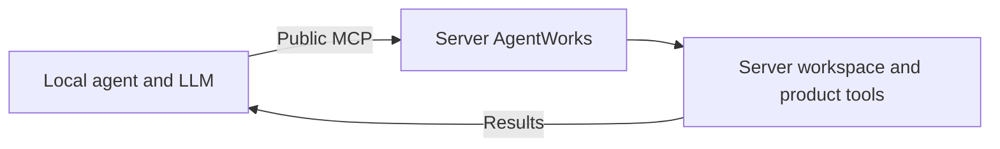
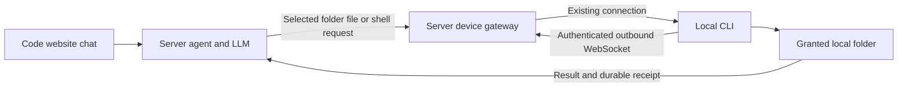

# Local and Server Agent Design

**Status: guarded public MCP writes, the file/shell executor and minimal Local chat mode implemented. Updated 2026-10-08.**

This document replaces the workspace-router proposal. Support two directions:

- **Local → server:** a local agent uses the existing public AgentWorks MCP to
  work with server-owned workflows. Extend that MCP with guarded file writes.
- **Server → local:** the agent and LLM run in the website's server backend;
  a connected laptop executes authorized file operations and granted shell commands in one selected folder.
  Use an internal authenticated device connection for these operations.

Keep each workspace authoritative on its owning machine. Neither direction
requires a synchronized filesystem or a second working copy.

The router prototype, placement/move APIs, special server authentication and
remote-only `mcp_only` enforcement have been removed. Local → server uses the
public MCP. Server → local has a dedicated `agentworks executor connect` command
and an authenticated outbound WebSocket connection for file operations and local shell commands.
The retired proposal remains available in Git history.

Implemented now:

- Public `write_file`, explicit optional `files:write` consent, persisted token
  folder caps, workflow access checks, revision conflicts and durable receipts.
- File-owning workspace service writes, including deployments where the agent
  server does not share its filesystem. The internal service route is not exposed
  through the general workspace proxy.
- Managed document, diff, upload, move/delete and Builder writes share the same
  cross-process serialization boundary. Unmanaged local editors or shell commands
  do not participate in that lock; reads and writes remain individually atomic.
- Executor login with `devices:connect`, owner-scoped device discovery and file
  list/read/write and granted shell tools for interactive Code chat agents, local guard enforcement,
  heartbeat/reconnect, token revocation and pending-request failure on disconnect.
- Local file writes and shell commands retain private receipts across reconnects/restarts. The
  server never blindly resends a write or shell command after a timeout or disconnect.
- Code **Settings → General → Local CLI connection** offers **Connect local files**.
  The browser-scoped binding takes over file access for the current Code chat.
  The right side shows only **Local CLI connection**, **Costs**, and **Models**.
  The connection panel provides CLI setup, folder selection, status and disconnect.
  File reads, edits and granted laptop shell commands happen through the agent in chat.
- Local-connected turns exclude MCP connections, skills, project/Vault secrets,
  background agents, server terminal/browser tools and other server adapters.
  Dashboards/databases, schedules/triggers and messaging stay disabled. Saved
  settings are excluded from the turn without changing project configuration.
  Offline bindings retain these restrictions. Disconnect restores normal Code.
  Other chats and existing server schedules/connections are unchanged.

The executor supports files and laptop shell commands enabled automatically for every shared folder, including builds and tests. Browser tools, laptop workflow routing,
schedules, device-management panels, public history/restore APIs and retention
policies are outside this change.
Before-content history is capped at 128 KiB per write; full revisions are retained.
Device connections currently live in one backend process. Deployments with
multiple backend instances need routing affinity for device and chat requests.
No production deployment or external LLM call is performed by this change.

## 1. Decisions and boundaries

| Topic | Decision |
|---|---|
| Local agent accessing server workflows | Use the existing separate public MCP, `/api/external/v1/mcp` |
| Public MCP file writes | Add `write_file` with explicit permission, folder guards, revision checks and audit history |
| Plans and configuration | Keep direct file writes blocked; change them through typed tools |
| Transparent local workspace routing | Retire the branch's router approach; do not introduce a second remote file-access system |
| Server agent accessing laptop resources | Use a laptop executor connected to the same backend that serves the website |
| MCP for the website's own laptop executor | Not required; reuse internal tool handlers and their policy |
| Connection establishment | Laptop initiates an authenticated outbound connection |
| Files | Remain on their owning machine; reads return content to the agent |
| Browser-only website | Can use explicitly selected files where the browser supports it; cannot supply arbitrary local shell/application access |
| Full local tools | Require an installed/running laptop companion |

The public MCP and the CLI tool bridge are different interfaces. This design's
local → server direction uses the **separate public MCP**, not the coding CLI's
internal `mcpbridge`. Our own server → local executor does not need to convert
every internal tool call into an external MCP call.

## 2. Use cases

| Direction | Good fit | Dependency |
|---|---|---|
| Local → server | A person's Claude/Codex/other agent reads and edits shared workflow code or documents using that person's LLM | Server endpoint is reachable and the connection has the required grants |
| Local → server | Inspect runs, call workflow functions, ask Crews or manage permitted Vault resources from an external agent | Existing product tools and their independent permissions |
| Server → local | The website supplies the model and conversation while a developer keeps source files on their laptop | Laptop executor is connected |
| Server → local | The website agent reads and edits files within an explicitly shared local folder | Explicit device/folder/tool grants and an appropriate local executor |

Using a server LLM alone does not require moving the agent loop. A local loop
with a server model gateway is a separate, simpler option if centralized model
credentials and billing are the only requirement.

## 3. Local → server through public MCP



The local agent discovers operations through `get_api_spec` and invokes them
with `call_tool`. Workflow IDs identify resources; caller-supplied filesystem
roots must not select arbitrary server directories.

The existing catalog already includes raw file reads/listing/search, plans,
run evidence and controls, workflow functions, Crew operations, Brain and
authorized Vault administration. The effective catalog depends on the
connection's scopes and the caller's live permissions.

Add direct file authoring so the local model can decide an edit and submit it
without asking a second model to rewrite the file. Existing `builder_chat`
remains an explicit delegation to the **server's configured Builder model**.
Likewise, calling run/step/Crew operations invokes the configured service-side
execution; adding file writes does not relocate those agents to the laptop.

Provider-native tools on the laptop still operate on laptop resources. Remote
operations must name the server's MCP tools. This direction does not require a
blanket shutdown of native tools for an otherwise local external agent.

### `write_file` contract

```json
{
  "name": "write_file",
  "arguments": {
    "workflow_id": "workflow-id-from-list_workflows",
    "path": "code/task.py",
    "content": "print('updated')\n",
    "expected_revision": "revision-returned-by-read_file",
    "request_id": "unique-id-for-this-intended-write"
  }
}
```

This tool is available to explicitly authorized connections. The first slice creates or
replaces bounded UTF-8 source/document files. Use `expected_revision: missing`
for creation. A successful response includes the resulting revision and audit
receipt. Delete, move, patch and binary upload are separate future decisions.

### Permission and folder-guard rules

Effective write authority is the intersection of:

**connection scope ∩ current user access ∩ granted write folders ∩ operation
policy**, with blocked/read-only/protected paths taking precedence.

- Require explicit `files:write` consent and current workflow edit access.
  Existing read/run connections do not silently acquire writes.
- Resolve the workflow and guard on the server. A public MCP request has no
  automatic right to inherit another chat's session guard, and a client-sent
  allowlist cannot widen access.
- Derive authoring-folder grants from the selected workflow and connection
  restrictions. Carry any legitimate execution-session narrowing as trusted
  server state. Define how folder caps are stored and issued before rollout;
  folder caps are persisted as `file_guard` on personal access tokens. OAuth write
  consent defaults to the workflow's public authoring paths; tokens can narrow it.
- Apply `WritePaths`, `BlockedPaths`, `BlockedWritePaths` and read-only grants
  using shared policy evaluation. Missing or unreadable required policy refuses
  the write.
- Normalize and confine paths before opening them; reject absolute paths,
  traversal, private paths and symlinks, including symlink substitution during
  the operation. Match path components, not a raw string prefix.
- Preserve the protected-file rules below even when the containing workflow
  folder is writable. Reading a plan can remain permitted.

| Example target | Direct file-write result |
|---|---|
| `code/task.py`, `docs/process.md` | Allowed within effective write grants |
| A folder granted only for reading | Rejected |
| `planning/*`, including `planning/plan.json` and step configuration | Rejected; use typed plan tools |
| `workflow.json`, `product.json`, `functions.json`, `workflow.json.kb-lock` | Rejected; use typed workflow/configuration tools |
| `costs/*`, `schedule-runs.json` | Rejected; runtime-managed records |
| Databases and their journal files | Rejected; use scoped database tools |
| Secret stores, authentication files, private runtime/audit state | Rejected |
| Another workflow, a path outside the grant, or a symlink escape | Rejected |

A `files:write` grant permits authoring executable source: later runs may execute
that source. It must therefore require authoring authority, not merely run or
read permission. This intentionally includes `code/<step>/`: editable authors
can change source without Builder's description-hash/code-lock validation.
Use Builder when those authoring checks are required. Direct source access is
not offered to run-only or read-only accounts. It does not grant shell execution,
plan writes or Vault access.

### Revisions, durability and retries

The file-owning service must check the revision and replace the file under one
shared SQLite serialization boundary per workflow or product project. MCP, browser
editing, version restores, document patch/move/delete/upload and Builder file edits
use the same physical scope. A long folder operation in one workflow does not
hold another workflow's lock. Direct
filesystem edits by other processes cannot be made transactional by this API.

Stage and atomically replace the file while preserving its Unix owner/group and
ordinary permission bits. Linux replacements also retain the access ACL; a
service unable to preserve ownership refuses the replacement before rename.
Record caller, workflow, path, request ID, previous/resulting revision and
recoverable history. Fail closed when required authorization or audit storage
is unavailable. If the file changed but receipt confirmation failed, report an
uncertain outcome that can be resolved by request ID instead of retrying blindly.

Retrying the same request ID and payload returns the recorded outcome. Reusing
that ID with a different payload is rejected. A revision conflict requires
rereading and reconciling; it must not turn into an unconditional overwrite.

The shared `workflowfiles` editor owns guarded writes and durable receipts at
per-root hashed directories beneath `WORKSPACE_FILE_STATE_DIR`, or under
configured `AGENTWORKS_STATE_ROOT`, with
`.<docs-folder>-file-edits/` as the private sibling fallback. Records
include authenticated user ID/name, connection ID, source, logical root, path,
request ID, before-content up to 128 KiB and
both revisions. Prepared records reconcile an interrupted atomic replacement.
Builder's existing operation audit remains separate; its mounted file writer
participates in the same serialization lock. Public writes always use the
file-owning service and therefore support separate service volumes. Agent and
workspace services must use the same shared private state directory and service
identity when both mount the documents. Docker Compose uses a shared state
volume; rootless/systemd deployments configure matching state roots. Receipts
are not automatically pruned; operators must retain request outcomes when
planning audit retention.

## 4. Server → local through the CLI executor



The server owns the agent loop and LLM. Local Code reuses the existing MCP bridge
tools and schemas: `execute_shell_command` (`command`, optional `timeout`) and,
for writable folders, `diff_patch_workspace_file` (`filepath`, `diff`). Only their
execution target changes. The selected laptop and folder are bound internally;
the agent does not receive new local file tools or device-selection arguments.
Reads and listing use shell commands such as `cat`, `sed`, `head` and `ls`.

Server coding CLI providers still require the internal `mcpbridge` executable.
The runtime honors `MCP_BRIDGE_BINARY`, then discovers an executable beside the
server binary (or in its sibling `.bin/` directory), then retains the provider's
`PATH`/`~/go/bin/` fallback. Discovery follows the installed server executable,
including release symlinks; agent-controlled working directories are never
searched. Release packaging must include the bridge. A missing server binary
cannot be supplied by the laptop connection.

Shell commands are enabled automatically for every folder shared through the CLI.
`--folder` uses a read-only filesystem sandbox; `--write-folder` permits file
changes and patch tools, including builds and tests that write project files.
No separate shell flag is required. File contents and command output reach the
server and LLM. The CLI accepts requests over its existing outbound connection.

### Connection and website experience

1. Open a Code chat and go to **Settings → General → Local CLI connection**
   in the right-side panel. The composer only displays the current connection;
   it has no Server/Local switch. Opening setup keeps server mode active.
2. Install the CLI, sign in with `devices:connect`, and run
   `agentworks executor connect` with named folder grants.
   This scope is exclusive and cannot be combined with remote MCP permissions.
   The executor refuses the home directory, its parents and any shared folder
   containing its credential config or private state. Share individual projects.
3. Select the computer and shared folder, review the consequences, then explicitly
   click **Use this folder**. Selection alone does not change the mode. The browser remembers this binding
   for the account, server workspace and current chat only.
4. The right-side toolbar offers **Local CLI connection**, **Costs**, and
   **Models**. The connection panel shows setup, folder permissions, status
   and disconnect. No file editor, terminal, browser, dashboard, automation,
   integrations or general project settings are shown.
5. The agent uses the existing shell and patch tools against the laptop from chat. MCP connections, skills,
   project/Vault secrets and background agents are excluded from local turns.
   Provider authentication remains available for the selected server model.
   Returned file contents and command output may be retained in server chat
   history, accessible through normal administrator and Code review permissions.
6. Disconnect asks the user to review the restored server file access and features,
   then explicitly choose **Switch to server files**. Connection changes are
   unavailable while a turn is running. Saved configuration and other chats
   remain unchanged; Ctrl-C in the CLI ends folder sharing.

Only interactive Code turns receive local tools. Crew, Brain, Vault, schedules,
messaging turns and unattended agents do not inherit this binding. Native
server filesystem/terminal/browser tools are disabled for connected turns.
Retained callbacks check the current turn and selected binding on every call.
Local sessions refuse synthetic notifications, notification steering and asks
from other chats; a registration from an earlier turn grants no new authority.

### Authority and failures

Every dispatch validates website ownership and live connection authorization.
The CLI independently checks local grants. Patches reuse the existing parser and
diff application, validate every file before mutation, and apply protected-file
rules and revision checks. Shell is available for read-only and writable folders.
Within writable grants, arbitrary programs
can modify project files, including git metadata, plans or databases. OS sandboxing
limits filesystem access to folder grants and runtime system/scratch paths and
enforces `--block` and `--read-only` exclusions. CLI credentials and receipt state
are denied, and command environments omit login/provider secrets. Shell execution
requires an editable owner account; read-only folder grants allow inspection but
block writes in the OS sandbox. A missing sandbox
refuses execution; commands never fall back to server execution. Absolute roots
are omitted from grant metadata; command output can contain local paths.

An offline device retains the binding and restrictions. Ordinary chat can
continue; local file and shell calls fail without server fallback. Connection controls
remain available during setup and offline.

Patch operations use revision checks and authenticated write receipts. Request
identities are generated internally, rather than added to the bridge tool schemas.
Both read-only and writable folders use private command receipt storage outside
the shared folder. The transport never retries mutations automatically. Completed
shell results survive reconnects/restarts; an interrupted command with an unknown
outcome is not executed again under the same request identity. Inspect current
files before deciding to issue another patch or command after an uncertain result.
Commands return the existing bridge stdout/stderr/exit-code response, capture at
most 1 MiB per stream, default to 60 seconds and allow at most 300 seconds.
Cancellation, disconnect and revocation stop active commands and their process
groups. Builds/tests run on the laptop; typed workflow editing, laptop workflow
routing and browser tools remain excluded.
Linux uses the launcher embedded in the CLI with Landlock; macOS uses sandbox-exec.

The device registry currently lives in one backend process. Multiple instances
need routing affinity for device and chat requests. This change does not deploy
the service or invoke an external LLM.

## 5. Existing implementation references

| Area | Source |
|---|---|
| Public MCP transport and discovery | [external_mcp.go](../../agent_go/cmd/server/external_mcp.go) |
| External catalog and dispatch | [external_tools.go](../../agent_go/cmd/server/external_tools.go) |
| Public tool admission | [product.yaml](../../agent_go/internal/agentworksproduct/product.yaml) |
| Token scopes and issuance | [store.go](../../agent_go/pkg/accesstokens/store.go), [mcp_oauth.go](../../agent_go/cmd/server/mcp_oauth.go) |
| Existing bounded file reads | [external_file_reads.go](../../agent_go/cmd/server/external_file_reads.go) |
| Existing managed Builder file writer | [external_builder_workspace.go](../../agent_go/cmd/server/external_builder_workspace.go) |
| Builder audit/history | [external_builder_audit.go](../../agent_go/cmd/server/external_builder_audit.go) |
| Session folder-guard state | [types.go](../../agent_go/pkg/common/types.go) |

Related documentation: [public MCP and CLI](../getting-started/agentworks-cli-mcp.md),
[folder guards](folder_guard_system.md), [workflow scheduling](../workflow/workflow_scheduling.md).
