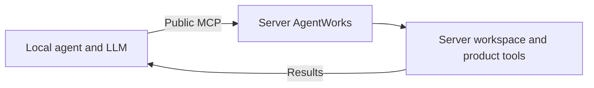
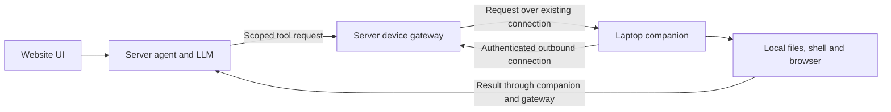

# Local and Server Agent Design

**Status: guarded public writes and the file executor implemented; broader local tool support remains future work. Updated 2026-10-06.**

This document replaces the workspace-router proposal. Support two directions:

- **Local → server:** a local agent uses the existing public AgentWorks MCP to
  work with server-owned workflows. Extend that MCP with guarded file writes.
- **Server → local:** the agent and LLM run in the website's server backend;
  a connected laptop executes authorized operations on its local files and tools.
  Use an internal authenticated device connection. MCP is optional here.

Keep each workspace authoritative on its owning machine. Neither direction
requires a synchronized filesystem or a second working copy.

The router prototype, placement/move APIs, special server authentication and
remote-only `mcp_only` enforcement have been removed. Local → server uses the
public MCP. Server → local has a dedicated `agentworks executor connect` command
and an authenticated outbound WebSocket connection for file operations.
The retired proposal remains available in Git history.

Implemented now:

- Public `write_file`, explicit optional `files:write` consent, persisted token
  folder caps, workflow access checks, revision conflicts and durable receipts.
- File-owning workspace service writes, including deployments where the agent
  server does not share its filesystem. The internal service route is not exposed
  through the general workspace proxy.
- Managed document, diff, upload, move/delete and Builder writes share the same
  cross-process serialization boundary. Unmanaged local editors or shell commands
  do not participate in that lock; reads and writes remain individually atomic.
- Executor login with `devices:connect`, owner-scoped device discovery and file
  list/read/write tools for website chat agents, local guard enforcement,
  heartbeat/reconnect, token revocation and pending-request failure on disconnect.
- Local file writes retain private receipts across reconnects/restarts. The
  server never blindly resends a write after a timeout or disconnect.

The first executor is file-only. Shell/browser operations, workflow execution
against laptop-owned plans, a website device-management panel, remote schedules,
public history/restore APIs and history retention policies remain future work.
Before-content history is capped at 128 KiB per write; full revisions are retained.
Device connections currently live in one backend process. Deployments with
multiple backend instances need routing affinity for device and chat requests.
No production deployment or external LLM call is performed by this change.

## 1. Decisions and boundaries

| Topic | Decision |
|---|---|
| Local agent accessing server workflows | Use the existing separate public MCP, `/api/external/v1/mcp` |
| Public MCP file writes | Add `write_file` with explicit permission, folder guards, revision checks and audit history |
| Plans and configuration | Keep direct file writes blocked; change them through typed tools |
| Transparent local workspace routing | Retire the branch's router approach; do not introduce a second remote file-access system |
| Server agent accessing laptop resources | Use a laptop executor connected to the same backend that serves the website |
| MCP for the website's own laptop executor | Not required; reuse internal tool handlers and their policy |
| Connection establishment | Laptop initiates an authenticated outbound connection |
| Files | Remain on their owning machine; reads return content to the agent |
| Browser-only website | Can use explicitly selected files where the browser supports it; cannot supply arbitrary local shell/application access |
| Full local tools | Require an installed/running laptop companion |

The public MCP and the CLI tool bridge are different interfaces. This design's
local → server direction uses the **separate public MCP**, not the coding CLI's
internal `mcpbridge`. Our own server → local executor does not need to convert
every internal tool call into an external MCP call.

## 2. Use cases

| Direction | Good fit | Dependency |
|---|---|---|
| Local → server | A person's Claude/Codex/other agent reads and edits shared workflow code or documents using that person's LLM | Server endpoint is reachable and the connection has the required grants |
| Local → server | Inspect runs, call workflow functions, ask Crews or manage permitted Vault resources from an external agent | Existing product tools and their independent permissions |
| Server → local | The website supplies the model and orchestration while a developer keeps repositories and build tools on their laptop | Laptop executor is connected |
| Server → local | The website agent works with local documents, downloads, an authenticated local browser or local applications | Explicit device/folder/tool grants and an appropriate local executor |

Using a server LLM alone does not require moving the agent loop. A local loop
with a server model gateway is a separate, simpler option if centralized model
credentials and billing are the only requirement.

## 3. Local → server through public MCP



The local agent discovers operations through `get_api_spec` and invokes them
with `call_tool`. Workflow IDs identify resources; caller-supplied filesystem
roots must not select arbitrary server directories.

The existing catalog already includes raw file reads/listing/search, plans,
run evidence and controls, workflow functions, Crew operations, Brain and
authorized Vault administration. The effective catalog depends on the
connection's scopes and the caller's live permissions.

Add direct file authoring so the local model can decide an edit and submit it
without asking a second model to rewrite the file. Existing `builder_chat`
remains an explicit delegation to the **server's configured Builder model**.
Likewise, calling run/step/Crew operations invokes the configured service-side
execution; adding file writes does not relocate those agents to the laptop.

Provider-native tools on the laptop still operate on laptop resources. Remote
operations must name the server's MCP tools. This direction does not require a
blanket shutdown of native tools for an otherwise local external agent.

### `write_file` contract

```json
{
  "name": "write_file",
  "arguments": {
    "workflow_id": "workflow-id-from-list_workflows",
    "path": "code/task.py",
    "content": "print('updated')\n",
    "expected_revision": "revision-returned-by-read_file",
    "request_id": "unique-id-for-this-intended-write"
  }
}
```

This tool is available to explicitly authorized connections. The first slice creates or
replaces bounded UTF-8 source/document files. Use `expected_revision: missing`
for creation. A successful response includes the resulting revision and audit
receipt. Delete, move, patch and binary upload are separate future decisions.

### Permission and folder-guard rules

Effective write authority is the intersection of:

**connection scope ∩ current user access ∩ granted write folders ∩ operation
policy**, with blocked/read-only/protected paths taking precedence.

- Require explicit `files:write` consent and current workflow edit access.
  Existing read/run connections do not silently acquire writes.
- Resolve the workflow and guard on the server. A public MCP request has no
  automatic right to inherit another chat's session guard, and a client-sent
  allowlist cannot widen access.
- Derive authoring-folder grants from the selected workflow and connection
  restrictions. Carry any legitimate execution-session narrowing as trusted
  server state. Define how folder caps are stored and issued before rollout;
  folder caps are persisted as `file_guard` on personal access tokens. OAuth write
  consent defaults to the workflow's public authoring paths; tokens can narrow it.
- Apply `WritePaths`, `BlockedPaths`, `BlockedWritePaths` and read-only grants
  using shared policy evaluation. Missing or unreadable required policy refuses
  the write.
- Normalize and confine paths before opening them; reject absolute paths,
  traversal, private paths and symlinks, including symlink substitution during
  the operation. Match path components, not a raw string prefix.
- Preserve the protected-file rules below even when the containing workflow
  folder is writable. Reading a plan can remain permitted.

| Example target | Direct file-write result |
|---|---|
| `code/task.py`, `docs/process.md` | Allowed within effective write grants |
| A folder granted only for reading | Rejected |
| `planning/*`, including `planning/plan.json` and step configuration | Rejected; use typed plan tools |
| `workflow.json` | Rejected; use typed workflow/configuration tools |
| Databases and their journal files | Rejected; use scoped database tools |
| Secret stores, authentication files, private runtime/audit state | Rejected |
| Another workflow, a path outside the grant, or a symlink escape | Rejected |

A `files:write` grant permits authoring executable source: later runs may execute
that source. It must therefore require authoring authority, not merely run or
read permission. It does not grant shell execution, plan writes or Vault access.

### Revisions, durability and retries

The file-owning service must check the revision and replace the file under one
shared SQLite serialization boundary outside the documents root. MCP, browser
editing, document patch/move/delete/upload and Builder file edits use it. Direct
filesystem edits by other processes cannot be made transactional by this API.

Stage and atomically replace the file while preserving appropriate file modes.
Record caller, workflow, path, request ID, previous/resulting revision and
recoverable history. Fail closed when required authorization or audit storage
is unavailable. If the file changed but receipt confirmation failed, report an
uncertain outcome that can be resolved by request ID instead of retrying blindly.

Retrying the same request ID and payload returns the recorded outcome. Reusing
that ID with a different payload is rejected. A revision conflict requires
rereading and reconciling; it must not turn into an unconditional overwrite.

The shared `workflowfiles` editor owns guarded writes and durable receipts at
`WORKSPACE_FILE_STATE_DIR`, or under configured `AGENTWORKS_STATE_ROOT`, with
`.<docs-folder>-file-edits/` as the private sibling fallback. Records
include authenticated user ID/name, connection ID, source, logical root, path,
request ID, before-content up to 128 KiB and
both revisions. Prepared records reconcile an interrupted atomic replacement.
Builder's existing operation audit remains separate; its mounted file writer
participates in the same serialization lock. Public writes always use the
file-owning service and therefore support separate service volumes.

## 4. Server → local through a laptop executor



The website backend owns the agent loop and LLM access. Its tool registry routes
local-resource operations to a selected connected device. The laptop executor
checks the request against its grants and runs the existing local tool handlers.
Results return to the server's agent loop.

Native filesystem/shell tools running on the server see the server's filesystem.
They cannot stand in for a laptop operation. Use explicitly targeted laptop
tools; any permitted server tools have their own resource identity and policy.

The authoritative workflow files, including plans and durable local outputs,
remain on the laptop for a local workspace. Typed plan/configuration tools must
also route to its owning service. Server orchestration cannot retain direct
server-disk assumptions for those resources. Transient execution state and LLM
context may live on the server; chat/history persistence is an open decision.

### Establishing the connection

1. The signed-in user pairs a laptop executor with their server account.
2. The laptop establishes an outbound authenticated connection to the backend.
3. The backend associates it with a user, device and revocable connection grant.
4. The website lets the user select an online device and grant local resources
   and operations. Scope increases require an explicit grant change.
5. Agent requests travel back over the established connection; laptop results
   return on the same channel.

An outbound TLS WebSocket with request multiplexing is the preferred candidate
for the app. Exact endpoints, framing and credential issuance remain to be
designed. MCP need not be the wire protocol: reuse internal tool schemas and
handlers. If external clients need laptop tools later, an MCP adapter can expose
the same guarded executor.

A reverse SSH tunnel can prove connectivity in a developer-only experiment.
It is not the intended user onboarding or multi-user routing mechanism.

### Device and execution authority

- Bind each request to the authenticated user, selected device, workspace,
  execution/session, tool and request ID. The backend must not select another
  user's device based on a model-supplied identifier.
- The laptop holds its own grant policy and independently refuses requests
  outside it. The connection carries operations, not blanket desktop authority.
- Prefer registered resource IDs over server-supplied absolute laptop paths.
  Resolve them to granted roots locally and apply the same protected-file rules.
- Local shell tools need both tool permission and filesystem/process confinement.
  Adding file-write permission does not authorize shell execution.
- Inject permitted local secrets inside local execution. Do not send plaintext
  credential stores or a bulk secret environment to the server. Tool outputs
  can contain sensitive content and need the existing output controls.
- Browser/application operations use the existing local handlers, authenticated
  namespaces and session locking. A server browser cannot reuse a laptop's
  browser login merely because its agent knows the task.
- Recheck revocation at dispatch and before execution. Define cancellation and
  process cleanup for work already running when its grant is revoked.

### Availability and delivery

Show device connectivity and pending tool work in the website. An offline or
sleeping laptop cannot execute local tools. A connected server does not make a
local workspace always available.

Use heartbeats, bounded reconnects, deadlines, request IDs, cancellation and
streaming outputs. On disconnect, distinguish work that never started from
work whose outcome is unknown. Persist enough receipts to reconcile reconnects;
do not replay uncertain shell commands or file mutations automatically.

Local-workspace schedules require an eligible connected device. Device choice,
missed-run behavior and prevention of duplicate execution remain open decisions;
the retired proposal's pinned-laptop/server-lease model is not a current promise.

### Website-only versus companion

Browser-supported file access can support user-selected files or folders within
browser permissions. It does not supply arbitrary local shell commands,
background filesystem access or control of installed applications.

The full server → local design therefore requires a running companion. The
website supplies task/chat controls, device selection and grant management.
The companion supplies local execution and connection lifecycle.

## 5. Crew, Code, Vault and data ownership

Workflow file access does not relocate a Crew, Code, browser or Vault. Explicit
product operations keep their existing execution ownership and permissions.

- In local → server mode, asking a server Crew or running a server workflow uses
  that service's configured agent and credentials. A local external agent can
  separately use its own local tools.
- In server → local mode, local file/shell/browser tools execute on the selected
  laptop. Any server-hosted Crew or Vault operation remains a server operation;
  choosing a laptop does not copy those credentials there.
- Sharing workflow files does not transfer laptop logins, place-connection
  stores or secret encryption keys between devices.
- When a local executor uses a permitted credential, it performs the operation
  locally and returns its result. Explicit secret export is not part of this
  design.

File location and data visibility are different. A local file read by the server
agent is sent to the server and potentially its LLM provider. Conversely, an
external local agent reading a server file receives that content on the laptop.
Neither direction promises that file contents never leave their storage host.

## 6. Implementation sequence

1. **Retire the router prototype.** Remove placement files/routes, workflow
   moves, remote-scratch routing, special server-mode auth and disk-access bypasses
   introduced solely for that proposal. Remove its remote-only CLI tool-mode
   enforcement. Preserve main's existing auth, confinement and workspace APIs.
   Review shared helpers separately so useful ordinary file-write improvements
   are not confused with router functionality.
2. **Public MCP file writes.** Implement shared policy and write ownership,
   explicit `files:write` issuance/consent, the catalog/schema/dispatcher and
   audit/retry behavior. Keep `plan:write` out of generic file authoring. Update
   MCP discovery instructions, OAuth/Connect UI and documentation together.
3. **Prove local → server.** Use a real external local agent to read a revision,
   write source/documents and verify results, with protected-plan writes refused.
   Existing Builder delegation and read/run connections must keep working.
4. **Prove server → local.** Start with a paired device and guarded file reads/
   writes using the server model. Then add scoped local execution/browser tools
   and workflow ownership adapters as needed.
5. **Complete device lifecycle.** Reconnect, outcome reconciliation, cancellation,
   revocation, website device status and schedule behavior before broader use.

Steps 1–2 and the file-only connection in step 4 are implemented. Automated tests
exercise real MCP and WebSocket clients for steps 3–4; they do not call an external
LLM. Reconnect/revocation/receipts are implemented; broader lifecycle and local
shell/browser/workflow adapters in steps 4–5 remain future work.

## 7. Validation requirements

- Public MCP discoverability reflects write consent; existing read/run grants
  still cannot write. Revoked or downgraded access fails on the next operation.
- Both transports enforce writable, read-only, blocked and protected folders.
  Test traversal, prefix siblings, symlinks and changes during path resolution.
- Source/document writes succeed while plan/configuration/database/private writes
  fail. Typed plan tools still operate under their own authority.
- Concurrent writes from different processes/transports cannot silently overwrite
  one another. Revision conflicts, duplicate requests and uncertain receipts have
  explicit recoverable outcomes.
- Writes work when agent and workspace services do not share a local volume.
- One user cannot select another user's device, grant or execution session.
- Disconnect, laptop sleep, reconnect, cancellation and revocation do not cause
  automatic duplicate execution. Multi-device delivery has an explicit owner.
- The server agent can operate local resources without launching a second local
  Builder model. Browser targets remain local when a local browser is selected.

## 8. Open decisions

- How public MCP folder caps are represented, persisted and presented in consent.
- Where the shared revision/write/audit transaction lives and how every writer
  participates, including service-volume separation.
- Whether direct remote shell/database operations are needed beyond the existing
  public product tools; their scopes must be independent of `files:write`.
- Laptop pairing, credential renewal, revocation and device ownership UI.
- Device connection wire format and outcome receipt persistence.
- Server orchestration adapters for laptop-owned plans, configuration, databases,
  output files and histories; policy for server-persisted chat/context retention.
- Local-workspace schedule behavior, multi-device selection and leases if needed.

## 9. Existing implementation references

| Area | Source |
|---|---|
| Public MCP transport and discovery | [external_mcp.go](../../agent_go/cmd/server/external_mcp.go) |
| External catalog and dispatch | [external_tools.go](../../agent_go/cmd/server/external_tools.go) |
| Public tool admission | [product.yaml](../../agent_go/internal/agentworksproduct/product.yaml) |
| Token scopes and issuance | [store.go](../../agent_go/pkg/accesstokens/store.go), [mcp_oauth.go](../../agent_go/cmd/server/mcp_oauth.go) |
| Existing bounded file reads | [external_file_reads.go](../../agent_go/cmd/server/external_file_reads.go) |
| Existing managed Builder file writer | [external_builder_workspace.go](../../agent_go/cmd/server/external_builder_workspace.go) |
| Builder audit/history | [external_builder_audit.go](../../agent_go/cmd/server/external_builder_audit.go) |
| Session folder-guard state | [types.go](../../agent_go/pkg/common/types.go) |

Related documentation: [public MCP and CLI](../getting-started/agentworks-cli-mcp.md),
[folder guards](folder_guard_system.md), [workflow scheduling](../workflow/workflow_scheduling.md).
